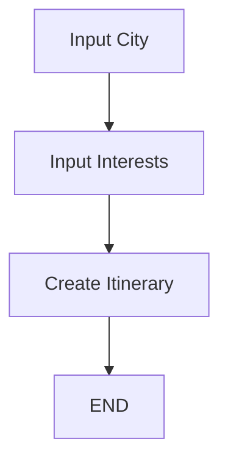

# 🌍 Travel Agent - LLM Powered Itinerary Planner

This project is a **personalized travel itinerary generator** built with [LangChain](https://www.langchain.com/), [LangGraph](https://github.com/langchain-ai/langgraph), and Large Language Models (LLMs).
It interactively collects user preferences (city, interests) and generates a **custom travel plan** using an LLM.

---

## ✨ Features

* 🏙️ **City Selection** – Users can specify their travel destination.
* 🎭 **Interest Collection** – Users can choose interests (e.g., food, adventure, culture).
* 🗓️ **Dynamic Itinerary Generation** – LLM generates a day-by-day travel plan.
* 🔄 **StateGraph Workflow** – Structured flow of planning steps using LangGraph.
* 🖼️ **Graph Visualization** – Mermaid diagrams to visualize the planning process.
* 🔧 **Modular Design** – Easy to extend (e.g., hotels, budget, transport).

---

## 🛠️ Tech Stack

* **Python 3.10+**
* [LangChain](https://www.langchain.com/) – LLM integration
* [LangGraph](https://github.com/langchain-ai/langgraph) – StateGraph-based workflow
* [LangChain Core & Community](https://python.langchain.com/docs)
* [Groq / OpenAI](https://groq.com/) – Backend LLM provider
* **Jupyter Notebook** – Development & experimentation

---

## 📂 Project Structure

```
Travel_Agent.ipynb   # Main notebook with code
README.md            # Project documentation
```

Inside the notebook:

* **PlannerState** → Stores state (`city`, `interests`, `itinerary`)
* **Node Functions** → Steps of the planning process (`input_city`, `input_interests`, `create_itinerary`)
* **LLM Integration** → Generates final itinerary
* **Visualization** → Mermaid diagram of workflow

---

## 🚀 How It Works

1. **Input City** → User specifies the destination.
2. **Input Interests** → User selects areas of interest (adventure, food, history, etc.).
3. **Create Itinerary** → LLM generates a tailored plan.
4. **Output** → Personalized travel itinerary.

Example Flow:

```
Input City → Input Interests → Create Itinerary → END
```

---

## ▶️ Getting Started

### 1. Clone the Repository

```bash
git clone https://github.com/yourusername/travel-agent.git
cd travel-agent
```

### 2. Install Dependencies

```bash
pip install langchain langchain_core langchain_groq langchain_community langgraph
```

### 3. Run the Notebook

Open Jupyter Notebook or VSCode and run:

```bash
jupyter notebook Travel_Agent.ipynb
```

---

## 📸 Visualization

The planning process is visualized as a **state graph**:



---

## 🔮 Future Enhancements

* 🏨 Add hotel & restaurant recommendations
* 💰 Include budget planning
* 🚌 Suggest transport options
* 🌐 Deploy as a Gradio / Streamlit app for easy use

---

## 📜 License

This project is for **educational purposes**. Feel free to modify and extend.

---


